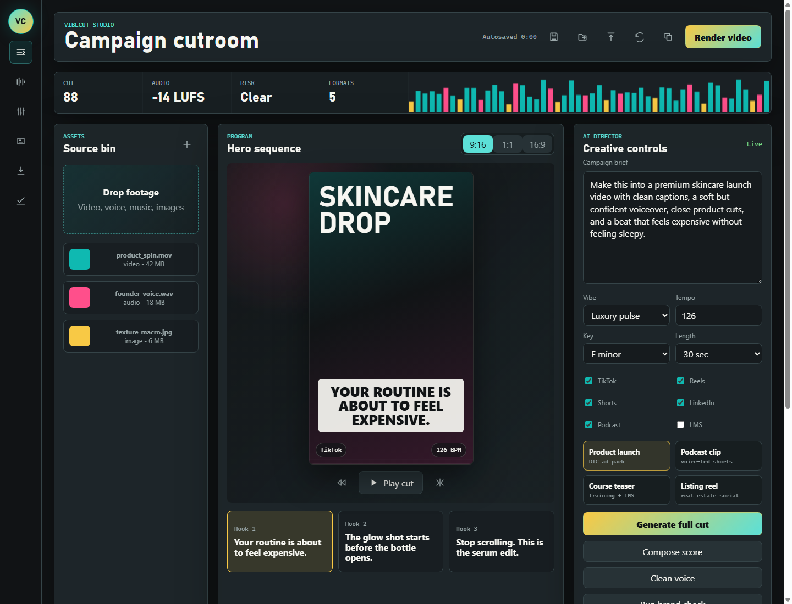

# VibeCut Studio

VibeCut Studio is a browser-based production workspace for creators, small businesses, and brand teams that need finished media fast without bouncing between five separate apps.

The product combines video editing, drag-and-drop assembly, original music sequencing, voice cleanup, captions, brand review, and export delivery into one studio surface.

This repo is intentionally static and dependency-free. GitHub Pages can serve it directly from the repository root because the app entrypoint is `index.html`, not the README.



## Product Positioning

Creators and companies are being pushed to publish more short-form video, more podcast clips, more paid ads, more launch assets, and more platform-specific versions of the same message. The hard part is not only cutting clips. The hard part is getting from raw material to a polished, brand-safe, platform-ready content pack.

VibeCut Studio is designed as the missing command center between raw footage and published media.

It answers one high-value user need:

> "Give me the full launch pack: video, captions, music, cleaned voice, approval checks, and exports."

## Skill Map

The original skill file references experience with video editors and audio tools:

- Shotcut or similar tools such as DaVinci Resolve, Adobe Premiere Pro, or Final Cut Pro
- OpenShot or similar tools such as iMovie, Kdenlive, or Clipchamp
- LMMS or similar tools such as Pro Tools, Logic Pro, or Ableton Live
- Ardour or similar tools such as FL Studio, GarageBand, or Reaper

VibeCut Studio combines those skills into one new product:

| Skill Area | Product Feature | Why It Matters |
| --- | --- | --- |
| Shotcut-style editing | Multi-track video timeline, cuts, split action, preview transport | Gives advanced users a familiar editing model |
| OpenShot-style editing | Drag-and-drop source bin, quick templates, guided generation | Keeps the app approachable for non-editors |
| LMMS-style music creation | Step sequencer, BPM, key, swing, sidechain, generated waveform | Creates original score ideas without leaving the app |
| Ardour-style audio production | Mixer, meters, voice cleanup, mastering to -14 LUFS | Makes voice and final audio sound publishable |

## What Is Built

This is not a landing page. The first screen is the working studio.

Current app surfaces:

- AI director panel with campaign brief, vibe, tempo, key, length, and platform controls
- Source bin with drag-and-drop local asset loading
- Local video and image preview through browser object URLs
- Program preview with aspect ratio switching for 9:16, 1:1, and 16:9
- Hook generator that creates three short-form opening lines
- Multi-track timeline for video, voice, music, and captions
- Timeline actions for adding clips, shuffling the cut, tightening gaps, and splitting on the beat
- LMMS-inspired beat sequencer with five channels: Kick, Snare, Hat, Bass, and Vox
- Web Audio beat playback directly in the browser
- Waveform canvas that reacts to sequencer and sound controls
- Ardour-inspired mixer with voice, beat, SFX, and master channels
- Voice cleanup action that updates audio state and review metadata
- Caption editor with timing, inline editing, and preview send action
- Caption style controls for case, position, and emphasis
- Brand review queue with approval and rewrite actions
- Forbidden-claim check against the brief and captions
- Export queue for TikTok, Reels, Shorts, LinkedIn, podcast audio, and team review
- Delivery inspector with render preset, FPS, duration, audio, caption, and brand slate controls
- Real browser-local WebM render from canvas, captions, uploaded media preview, and generated beat audio
- Timed caption burn-in during render
- SRT and VTT sidecar caption export
- Production manifest export with delivery settings, assets, captions, approvals, and render receipt
- Project JSON export for saving or handing work to another system
- Browser-local project save, load, import, and reset controls
- Autosave status, visual meters, keyboard focus states, and responsive layout

## How To Run Locally

The simplest path is to open `index.html` in a browser.

From PowerShell, this also works:

```powershell
Start-Process .\index.html
```

For a local server from this folder:

```powershell
py -3.11 -m http.server 4173
```

Then visit:

```text
http://localhost:4173
```

There is also a Windows launcher:

```powershell
.\launch-vibecut.cmd
```

## GitHub Pages

This repo is already arranged for GitHub Pages.

Best Pages setup:

1. Push the repository to GitHub.
2. Open the repository settings.
3. Go to Pages.
4. Set the source to deploy from a branch.
5. Choose the default branch and root folder.
6. Save.

Because `index.html` is in the repository root, the public Pages URL will open the app directly. It will not fall through to this README.

The `.nojekyll` file is included so GitHub Pages serves the static files as-is.

## Repository Standards

This repo should be treated like public developer work.

Expected practices:

- Keep commits focused and readable.
- Use a direct commit message that explains the user-facing change.
- Check `git status` before staging.
- Review the diff before committing.
- Do not stage unrelated local files.
- Keep the root `index.html` working for GitHub Pages.
- Do not break the static no-build setup unless a build system is intentionally added.
- Prefer issues for future product work and PRs for reviewable changes once the repo is public.

Suggested branch naming:

```text
codex/add-feature-name
feature/add-feature-name
fix/short-bug-name
docs/readme-update
```

Suggested commit style:

```text
Build VibeCut Studio app
Add desktop launcher
Document GitHub Pages deployment
Fix caption preview state
```

## Public Launch Notes

If this repo is made public, the README should communicate three things quickly:

1. The app is usable immediately in the browser.
2. It combines video editing, music creation, audio mixing, captions, and exports.
3. The project shows product thinking, UI craft, and practical media workflow knowledge.

That is why this README describes the product, the skill mapping, the business use case, and the deployment path instead of only listing files.

## Monetization Ideas

Possible business directions:

- Creator subscription: unlimited projects, export presets, project history
- Brand team plan: shared brand kits, approval queues, team comments
- Agency plan: client workspaces, watermark review links, reusable templates
- Marketplace: caption styles, music packs, motion templates, launch kits
- Enterprise media governance: audit trail, compliance checks, source licensing

## File Structure

```text
.
|-- index.html             App entrypoint for local use and GitHub Pages
|-- styles.css             Full responsive visual system and layout
|-- app.js                 App state, rendering, media preview, sequencer, exports
|-- launch-vibecut.cmd     Windows launcher for local desktop shortcut
|-- docs/
|   `-- vibecut-studio.png Public repo screenshot
|-- .nojekyll              GitHub Pages static serving marker
|-- .gitignore             Local noise exclusions
|-- skills.txt             Original source skills
`-- README.md              Product and repo documentation
```

## Technical Notes

The app uses:

- Plain HTML
- Plain CSS
- Plain JavaScript
- Canvas for meters and waveform visuals
- Canvas capture streams and MediaRecorder for local WebM rendering
- Web Audio for beat playback
- Web Audio render scheduling for generated beat audio in exported videos
- Browser object URLs for local media preview
- Local storage for browser-side project persistence
- No package manager
- No build step
- No external API keys
- No external CDN assets

This makes the project simple to publish, inspect, and run without setup friction.

## Current Limitations

The app is currently a front-end production tool with real local preview, real UI state, browser-local project storage, real Web Audio beat playback, real project JSON export, and real local WebM rendering through `MediaRecorder`.

It does not yet perform server-side rendering, codec-level transcoding beyond browser-supported WebM recording, stem separation, AI model inference, cloud storage, user accounts, or collaborative review links.

Those are the natural backend additions for a hosted commercial version.

## Suggested Next Issues

- Add persistent project save/load from local storage
- Add real media timeline trimming with in/out points
- Add waveform generation from uploaded audio
- Add caption import for SRT and VTT
- Add WebCodecs or FFmpeg.wasm render path
- Add shareable review links
- Add brand kit import/export
- Add GitHub Pages deployment badge after publishing
- Add product screenshots or workflow GIFs to this README

## Accessibility And UX Notes

The app includes:

- Keyboard focus states
- Button labels and accessible names
- Reduced motion support for animation-heavy areas
- Responsive layout for desktop and mobile widths
- High-contrast controls over dark production surfaces

## License

This repository is public for portfolio, product-discovery, and evaluation purposes.

The code is currently **all rights reserved**. People can view the work, but they do not have permission to copy, resell, redistribute, or reuse it in another product without written permission.
